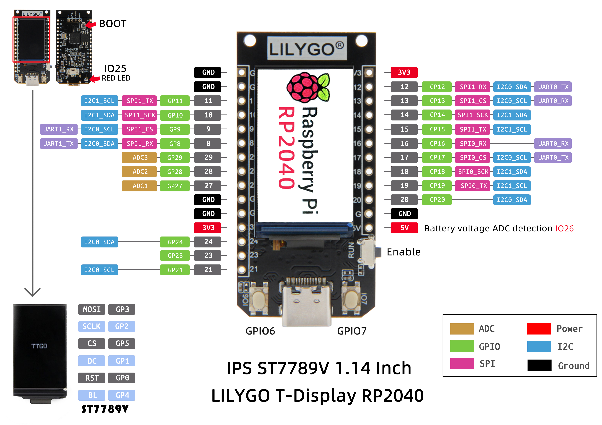
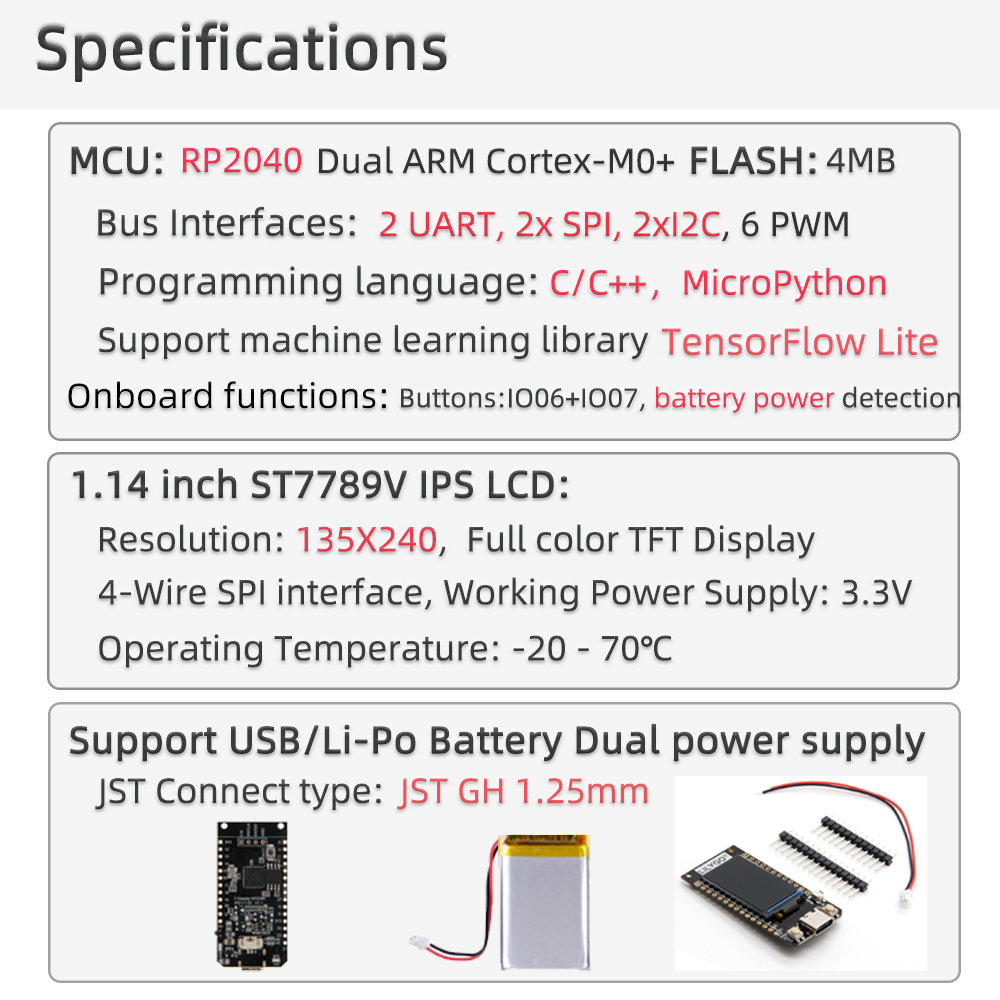

<h1 align = "center"> 🌟LilyGO T-Display RP2040🌟</h1>

## Quick start:

### Arduino

>1. Open up the Arduino IDE and go to File->Preferences.
>2. In the dialog that pops up, enter the following URL in the "Additional Boards Manager URLs" field:
```
https://github.com/earlephilhower/arduino-pico/releases/download/global/package_rp2040_index.json
```
> 3. Go to Tools->Boards->Board Manager in the IDE
> 4. Type "pico" in the search box and select "Add":
> 5. Copy  **TFT_eSPI**  to the  **<C:\Users\Your User Name\Documents\Arduino\libraries>**  directory
> 6. Open **Arduino IDE,** find **TFT_eSPI** in the file and example, the **T-Display** factory test program is located at **TFT_eSPI -> FactoryTest**, you can also use other sample programs provided by TFT_eSPI
> 7. In the **Arduino IDE** tool options, select the development board  **Raspbreey Pi Pico**, Other keep the default
> 8. Hold down the BOOT button, click the reset button, and release the BOOT button after a delay of one second or after waiting for the computer to eject a new disk
> 9. Finally, click upload or drag the firmware to the new disk





### MicroPython

>1. install [Thonny Python IDE](https://github.com/thonny/thonny/releases/download/v3.3.5/thonny-3.3.5.exe)
>2. After the installation is complete, you need to click on the toolbar, click Run -> Select Interpreter, enter the following interface, select **Raspberry Pi Pico**, you need to configure Pico before configuring the following ports
>3. Press the **BOOT** button, click **RES**, then go back to Thonny Python IDE and change the port to the serial port where Pico is located. If you don't find it, click **Install or update firmware**.
>4. Enter or save as a script to run
~~~
from machine import Pin, Timer
led = Pin(25,Pin.OUT)
tim = Timer()
def tick(timer):
    global led
    led.toggle()
tim.init(freq=2.5, mode=Timer.PERIODIC, callback=tick)
~~~
>5. If you need to save to the chip, you need to click **File->Save As->rp2040**


<h3 align = "left">Product 📷:</h3>

|  Product   |                                                                                                Product  Link                                                                                                 |
| :--------: | :----------------------------------------------------------------------------------------------------------------------------------------------------------------------------------------------------------: |
| T-Display RP2040 |   [AliExpress](https://www.aliexpress.com/item/1005003281043979.html)   |


| Pins       | RP2040          |
| ---------- | --------------- |
| TFT Driver | ST7789(240*135) |
| TFT_MISO   | N/A             |
| TFT_MOSI   | 3               |
| TFT_SCLK   | 2               |
| TFT_CS     | 5               |
| TFT_DC     | 1               |
| TFT_RST    | 0               |
| TFT_BL     | 4               |
| PWR_ON     | 22              |
| BOTTON1    | 6               |
| BOTTON2    | 7               |
| RedLED     | 25              |
